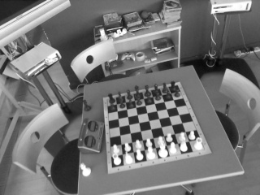
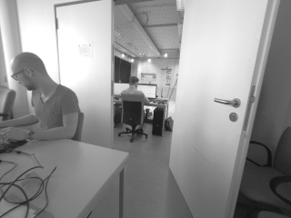
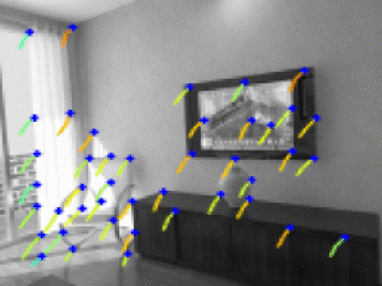
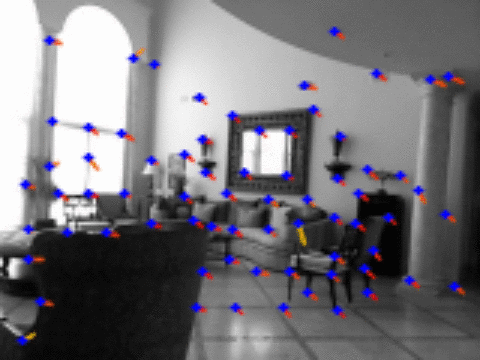

### Research @ Magic Leap

# SuperPoint Weights File and Demo Script

## Introduction 
This repo contains the pretrained SuperPoint network, as implemented by the originating authors. SuperPoint is a research project at Magic Leap. The SuperPoint network is a fully convolutional deep neural network trained to detect interest points and compute their accompanying descriptors. The detected points and descriptors can thus be used for various image-to-image matching tasks. For more details please see

* Full paper PDF: [SuperPoint: Self-Supervised Interest Point Detection and Description](https://arxiv.org/abs/1712.07629)

* Presentation PDF: [Talk at CVPR Deep Learning for Visual SLAM Workshop 2018](assets/DL4VSLAM_talk.pdf)

* Authors: *Daniel DeTone, Tomasz Malisiewicz, Andrew Rabinovich*

This demo showcases a simple sparse optical flow point tracker that uses SuperPoint to detect points and match them across video sequences. The repo contains two core files (1) a PyTorch weights file and (2) a python deployment script that defines the network, loads images and runs the pytorch weights file on them, creating a sparse optical flow visualization. Here are videos of the demo running on various publically available datsets:  

Freiburg RGBD:  


KITTI:  


Microsoft 7 Scenes:  


MonoVO:  



## Dependencies
* [OpenCV](https://opencv.org/) python >= 3.4
* [PyTorch](https://pytorch.org/) >= 0.4

This repo depends on a few standard pythonic modules, plus OpenCV and PyTorch. These commands usually work (tested on Mac and Ubuntu) for installing the two libraries:

```sh
pip install opencv-python
pip install torch
```

## Running the Demo
This demo will run the SuperPoint network on an image sequence and compute points and descriptors from the images, using a helper class called `SuperPointFrontend`. The tracks are formed by the `PointTracker` class which finds sequential pair-wise nearest neighbors using two-way matching of the points' descriptors. The demo script uses a helper class called `VideoStreamer` which can process inputs from three different input streams:

1. A directory of images, such as .png or .jpg
2. A video file, such as .mp4 or .avi
3. A USB Webcam

### Run the demo on provided directory of images in CPU-mode:

```sh
./demo_superpoint.py assets/icl_snippet/
```
You should see the following output from the ICL-NUIM sequence snippet:  



### Run the demo on provided .mp4 file in GPU-mode:

```sh
./demo_superpoint.py assets/nyu_snippet.mp4 --cuda
```
You should see the following output from the NYU sequence snippet:  



### Run a live demo via webcam (id #1) in CPU-mode:

```sh
./demo_superpoint.py camera --camid=1
```

### Run the demo on a remote GPU (no display) on 640x480 images and write the output to `myoutput/`
```sh
./demo_superpoint.py assets/icl_snippet/ --W=640 --H=480 --no_display --write --write_dir=myoutput/
```

### Additional useful command line parameters

* Use `--H` to change the input image height (default: 120).
* Use `--W` to change the input image width (default: 160).
* Use `--display_scale` to scale the output visualization image height and width (default: 2).
* Use `--cuda` flag to enable the GPU.
* Use `--img_glob` to change the image file extension (default: *.png).
* Use `--min_length` to change the minimum track length (default: 2).
* Use `--max_length` to change the maximum track length (default: 5).
* Use `--conf_thresh` to change the point confidence threshold (default: 0.015).
* Use `--nn_thresh` to change the descriptor matching distance threshold (default: 0.7).
* Use `--show_extra` to show more computer vision outputs.
* Press the `q` key to quit.


## BibTeX Citation
```txt
@inproceedings{detone18superpoint,
  author    = {Daniel DeTone and
               Tomasz Malisiewicz and
               Andrew Rabinovich},
  title     = {SuperPoint: Self-Supervised Interest Point Detection and Description},
  booktitle = {CVPR Deep Learning for Visual SLAM Workshop},
  year      = {2018},
  url       = {http://arxiv.org/abs/1712.07629}
}
```

## Additional Notes
* We do not intend to release the SuperPoint training or evaluation code, please do not email us to ask for it.
* We do not intend to release the Synthetic Shapes dataset used to bootstrap the SuperPoint training, please do not email us to ask for it.
* We use bi-linear interpolation rather than the bi-cubic interpolation described in the paper to sample the descriptor as it is faster and gave us similar results.

## Legal Disclaimer
Magic Leap is proud to provide its latest samples, toolkits, and research projects on Github to foster development and gather feedback from the spatial computing community. Use of the resources within this repo is subject to (a) the license(s) included herein, or (b) if no license is included, Magic Leap's [Developer Agreement](https://id.magicleap.com/terms/developer), which is available on our [Developer Portal](https://developer.magicleap.com/).
If you need more, just ask on the [forums](https://forum.magicleap.com/hc/en-us/community/topics)!
We're thrilled to be part of a well-meaning, friendly and welcoming community of millions.
